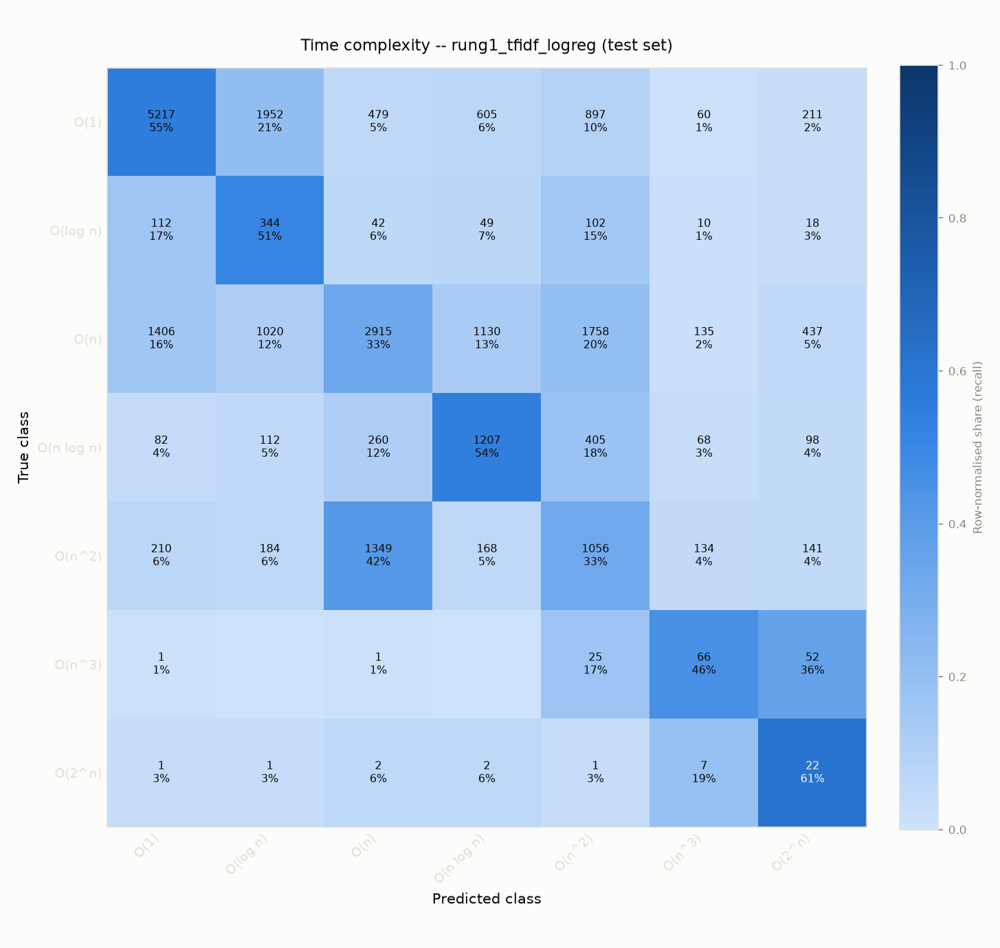
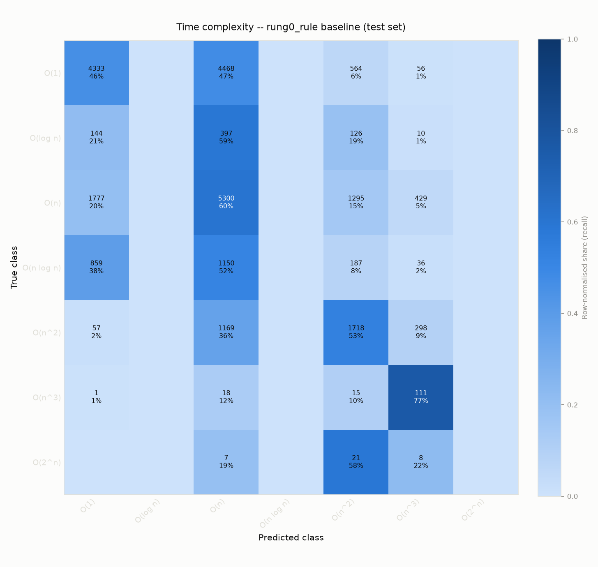
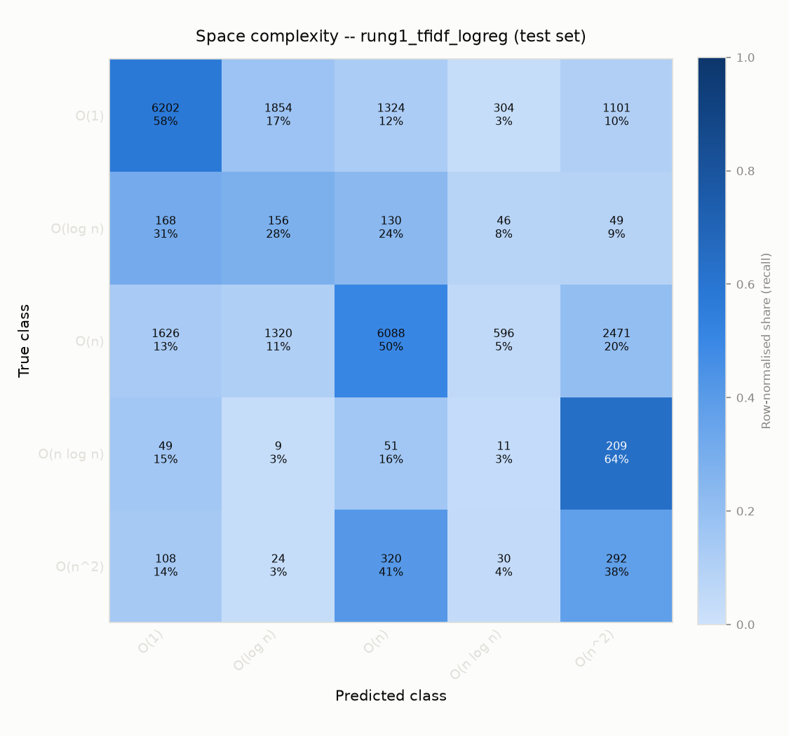
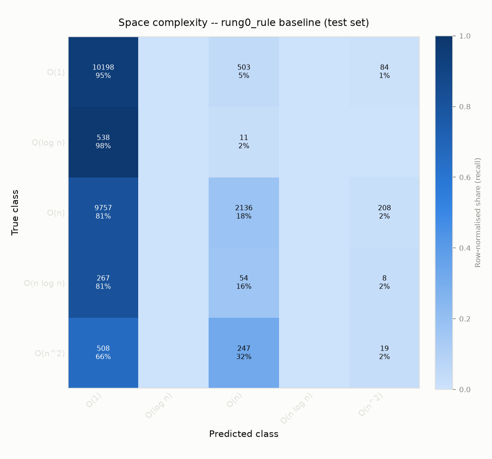

# PolyO model card v1
Phase 3 of 7 (plan §14). Rungs 0-2 (rule -> TF-IDF+logistic regression -> IR features+LightGBM), evaluated on a held-out, problem-level test split -- see plan §9: solutions to the same problem never cross a split boundary, and `tests/test_data_splits.py` enforces it in CI.

## Corpus
Python-only in this phase (plan §7's BigO(Bench) + CodeComplex ingestion, `data/ingest_bigobench.py` / `data/ingest_codecomplex.py`); C++ parses (Phase 1) but has no labelled corpus yet, so it isn't in this evaluation. Split sizes (problem-level, `data/build.py`):

```json
{
  "train": {
    "records": 141093
  },
  "val": {
    "records": 21879
  },
  "test": {
    "records": 26011
  }
}
```

Parsing/feature-extraction survival rate on the held-out test split (`models/dataset.py`) -- a real, arbitrary competitive-programming corpus occasionally trips a walker Phase 1's small hand-written examples never did:

```json
{
  "train": {
    "total": 141093,
    "parsed": 141093,
    "unsupported_language": 0,
    "failed": 0,
    "failure_types": {}
  },
  "val": {
    "total": 21879,
    "parsed": 21879,
    "unsupported_language": 0,
    "failed": 0,
    "failure_types": {}
  },
  "test": {
    "total": 26011,
    "parsed": 26011,
    "unsupported_language": 0,
    "failed": 0,
    "failure_types": {}
  }
}
```

## Time complexity

| Rung | n | Accuracy | Macro-F1 | Mean ordinal distance | ECE |
|---|---|---|---|---|---|
| rung0_rule | 24554 | 0.467 | 0.243 | 1.094 | n/a |
| rung1_tfidf_logreg | 24554 | 0.441 | 0.314 | 1.122 | 0.044 |
| rung2_gbdt | 24554 | 0.429 | 0.287 | 1.090 | 0.053 |





### Top rung-2 features (time)

| feature | importance |
|---|---|
| edge_count | 11533.0 |
| node_count | 10925.0 |
| call_count | 8865.0 |
| branch_count | 5403.0 |
| math_op_count | 5269.0 |
| alloc_count | 4254.0 |
| max_loop_nesting_depth | 2970.0 |
| loop_count | 2715.0 |
| break_count | 2044.0 |
| loop_count_depth_0 | 2041.0 |

### Reading these numbers (time)

- rung0_rule has the *highest accuracy* (0.467) but the *lowest macro-F1* (0.243 vs. 0.314) of the three -- it can only ever predict the classes its loop/alloc-depth lookup table covers (`models/rule.py`), so its F1 on every class outside that table is exactly 0.0, which is invisible in accuracy but not in macro-F1 (plan §9: never bare accuracy -- this is the concrete case that guards against).
- rung1 (TF-IDF over the full IR symbol sequence) currently beats rung2 (macro-F1 0.314 vs. 0.287) -- rung2's feature set deliberately excludes loop-bound shape and hash/set-lookup signals (see Known limitations below), which rung1's raw symbol n-grams still capture implicitly. Closing that feature gap is the most direct next step, not switching models.

## Space complexity

| Rung | n | Accuracy | Macro-F1 | Mean ordinal distance | ECE |
|---|---|---|---|---|---|
| rung0_rule | 24538 | 0.503 | 0.191 | 1.027 | n/a |
| rung1_tfidf_logreg | 24538 | 0.520 | 0.296 | 0.899 | 0.065 |
| rung2_gbdt | 24538 | 0.515 | 0.295 | 0.932 | 0.045 |





### Top rung-2 features (space)

| feature | importance |
|---|---|
| edge_count | 8943.0 |
| node_count | 8334.0 |
| call_count | 6734.0 |
| branch_count | 3930.0 |
| math_op_count | 3791.0 |
| alloc_count | 2898.0 |
| max_loop_nesting_depth | 1940.0 |
| loop_count | 1815.0 |
| break_count | 1437.0 |
| loop_count_depth_0 | 1329.0 |

### Reading these numbers (space)

- rung1 (TF-IDF over the full IR symbol sequence) currently beats rung2 (macro-F1 0.296 vs. 0.295) -- rung2's feature set deliberately excludes loop-bound shape and hash/set-lookup signals (see Known limitations below), which rung1's raw symbol n-grams still capture implicitly. Closing that feature gap is the most direct next step, not switching models.

## Known limitations (see `oracle/README.md`, `data/README.md`, `features/tabular.py` for full detail)

- BigO(Bench) labels are per-input-variable; only single-variable labels map to this taxonomy, and that's a real, measured drop rate, not a guess.
- Rung-2 features deliberately don't include loop-bound *shape* (const/input-dependent/halving) or hash/set-lookup detection -- both need static-analysis work beyond Phase 1's node-to-symbol IR mapping, or type inference this project's static design doesn't attempt.
- Space labels come from BigO(Bench) only (CodeComplex is time-only), so the space model trains on a smaller, less problem-diverse slice than time.
