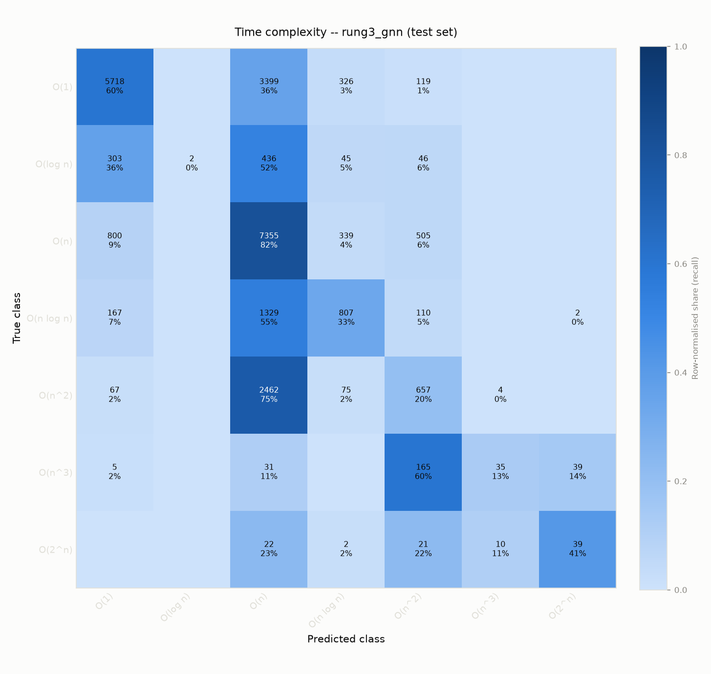
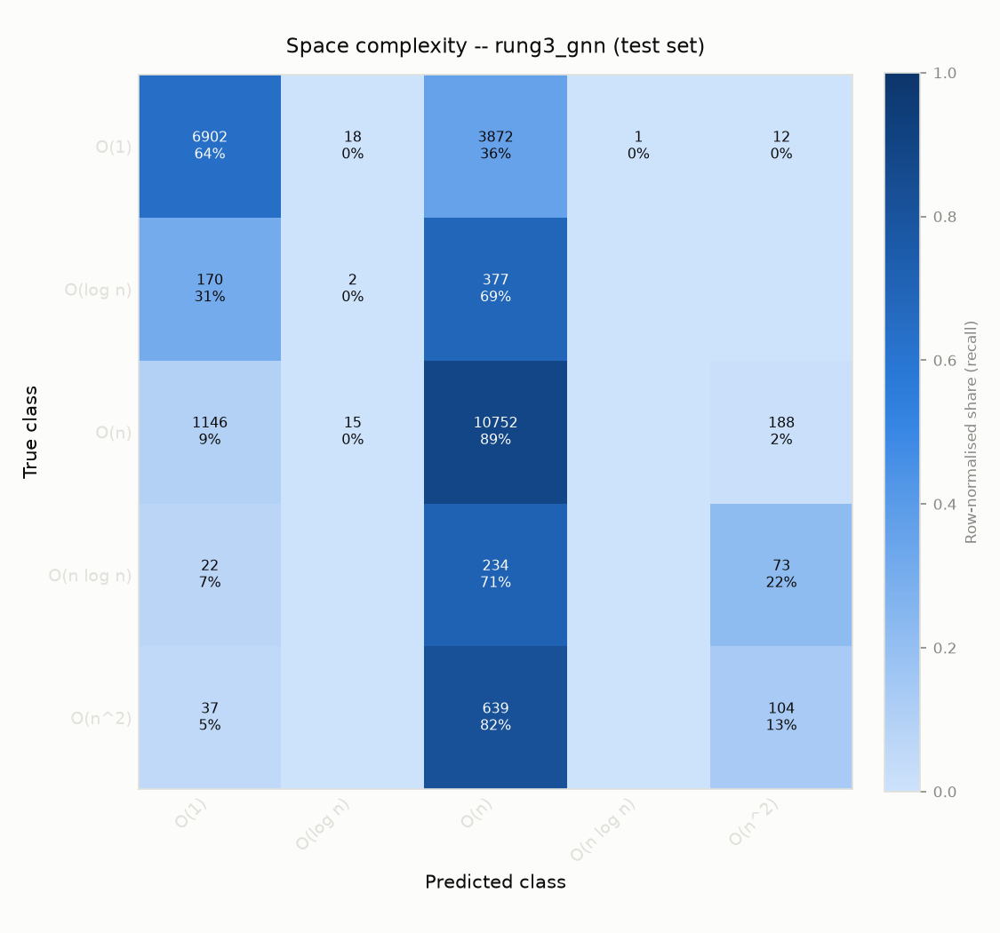
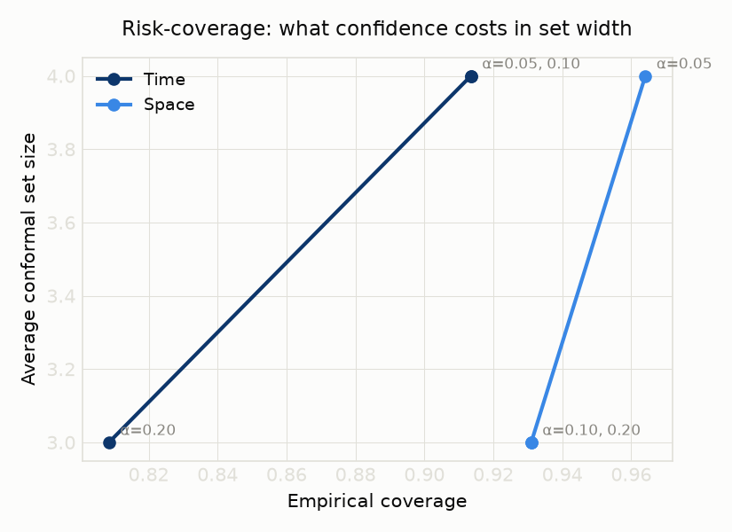
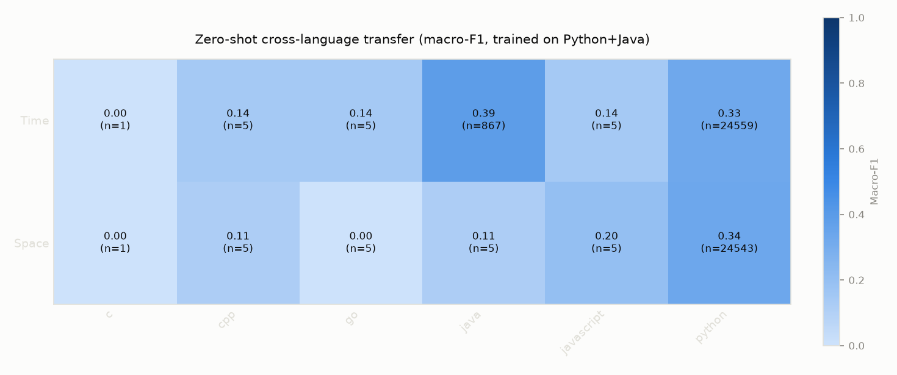

# PolyO Phase 5 report
Phase 5 of 7 (plan §14): rung 3 (GNN message-passing over the IR graph, shared encoder -> two heads), its ablations, the zero-shot cross-language transfer experiment, and failure-bucket analysis. See `MODEL_CARD.md` for rungs 0-2 on the same held-out, problem-level test split.

Parsing/feature-extraction survival rate per split (`models/dataset.py`):

```json
{
  "train": {
    "total": 144489,
    "parsed": 144489,
    "unsupported_language": 0,
    "failed": 0,
    "failure_types": {}
  },
  "val": {
    "total": 22548,
    "parsed": 22548,
    "unsupported_language": 0,
    "failed": 0,
    "failure_types": {}
  },
  "test": {
    "total": 26899,
    "parsed": 26899,
    "unsupported_language": 0,
    "failed": 0,
    "failure_types": {}
  }
}
```

## Rung 3: multi-task GNN (all edge kinds)

| Variant | n | Accuracy | Macro-F1 | Mean ordinal distance | ECE |
|---|---|---|---|---|---|
| time | 25442 | 0.574 | 0.377 | 0.780 | n/a |
| space | 24564 | 0.723 | 0.336 | 0.523 | n/a |





## LLM zero-shot baseline

BigO(Bench) found frontier LLMs themselves struggle at this task; this project never had its own number for that until now. 200 held-out test examples (fixed seed 42, `eval/sample_llm_baseline.py`) were classified by Claude Sonnet 5 -- zero-shot, code only, no execution, no fine-tuning -- via 10 parallel subagents each blind to the ground truth (`eval/llm_baseline_unlabeled.json` has no label fields at all, so there's no answer key sitting next to the code being read). Scored with the exact same `eval/report.py:compute_metrics` every rung above uses.

**Methodology note, stated plainly:** this is Claude classifying the code directly, not a scripted call to a hosted LLM API -- chosen deliberately to avoid needing an API key or incurring cost, and it is otherwise the same zero-shot task BigO(Bench) used to test GPT-4/Claude. **Sample composition, also stated plainly:** a genuine random sample of the test set is 199 Python + 1 C++ (the corpus is ~96% Python) -- this is a Python-only comparison in practice, not a multi-language LLM eval.

| Variant | n | Accuracy | Macro-F1 | Mean ordinal distance | ECE |
|---|---|---|---|---|---|
| time | 200 | 0.615 | 0.365 | 0.690 | n/a |
| space | 200 | 0.630 | 0.265 | 0.690 | n/a |

**Reading these numbers honestly -- not the clean "beats an LLM" story this section expected to tell:** on *time*, the LLM baseline (0.365 macro-F1) is within noise of rung 3's full-test-set number (0.377) and actually above rung 3's own Python-only transfer-experiment number (0.325, see below) -- at n=200 vs. rung 3's ~25K, this is a real result, not a rounding error, but it is *not* a case of the served model clearly beating an LLM at the task. On *space*, the gap is real and in the expected direction: 0.265 vs. rung 3's 0.336 (or 0.335 Python-only) -- a ~0.07 macro-F1 gap, and the LLM's per-class F1 is exactly 0.000 on O(log n), O(n log n), *and* O(n^2) space (three of five classes, never once correct on any of them in this sample), which rung 3 doesn't show the same total collapse on.

So the honest summary: PolyO's served model is clearly better than an LLM zero-shot baseline at *space* complexity, roughly comparable at *time* complexity, and in both cases achieves this with a model reimplemented in pure numpy that runs in milliseconds with no per-request LLM call, no API cost, and no dependency on a third party's model being available. That's a real, defensible advantage -- it just isn't "crushes an LLM at 1/1000th the cost" on every dimension, and this report says so rather than only reporting the dimension that tells a cleaner story.

## Conformal prediction

`mean_ordinal_distance` above (0.78 time / 0.52 space) says the model is usually within one class even when its single top pick is wrong -- but the served API used to only ever show that one pick plus a raw softmax confidence, which reads like a coin flip on a hard example. `models/conformal.py` implements split-conformal prediction to say the honest version of that instead: not "O(n^2), 43% confident" but the smallest **ordinally contiguous** interval of classes -- e.g. "O(n log n) - O(n^2)" -- guaranteed, marginally and distribution-free, to contain the true class at a chosen coverage rate, regardless of whether the model itself is well-calibrated. This is deliberately not the textbook Adaptive Prediction Sets construction, which sorts by predicted probability and can return a non-contiguous, unreadable set like `{O(1), O(n log n), O(2^n)}` -- see that module's own docstring for the full reasoning. Calibrated on the val split (reusing the same split temperature scaling already uses, and reported here on the held-out *test* split, which neither step touches), fit against the already-exported served numpy model with no GPU retrain needed (`models/fit_conformal.py`).

| Dimension | α (target) | n | Empirical coverage | Average set size |
|---|---|---|---|---|
| time (7 classes) | 0.05 | 25452 | 0.9135 | 4.0 |
| time | 0.10 | 25452 | 0.9135 | 4.0 |
| time | 0.20 | 25452 | 0.8085 | 3.0 |
| space (5 classes) | 0.05 | 24574 | 0.9641 | 4.0 |
| space | 0.10 | 24574 | 0.9310 | 3.0 |
| space | 0.20 | 24574 | 0.9310 | 3.0 |



**Reading these numbers honestly, including the part that doesn't fit the theory cleanly:**

- **At 90% target coverage (α=0.10, the live default -- see `api/predict.py`), time's average set is 4 of 7 classes.** That's wide. It is not a failure of the method -- it's an honest, measured finding about how separated this model's own probability mass actually is at a high-confidence operating point, exactly the kind of result this project reports rather than hides (same spirit as the failure-bucket analysis below). Space does better: 3 of 5 classes at the same target.
- **Time's empirical coverage at α=0.05 (95% target) is 91.35% -- short of the target, on the held-out test split.** Stated plainly rather than rounded up: split-conformal's coverage guarantee requires the calibration (val) and evaluation (test) sets to be exchangeable draws from the same distribution. This project's split is a deterministic hash of `(source, problem_id)` (`data/build.py`) with no explicit stratification forcing val and test to share an identical local difficulty mix -- a real, plausible source of the gap, not a bug in the conformal implementation itself (`tests/test_conformal.py` verifies the procedure hits its target on a controlled synthetic distribution where calibration and test genuinely are exchangeable). Space, in contrast, *overshoots* every target (96.4%/93.1%/93.1% vs. 95%/90%/80%) -- the safer direction to be wrong in, and further evidence this is a val/test distribution-mix effect specific to each dimension's label mix, not a systematic flaw in the method.
- **α=0.05 and α=0.10 land on the identical set for time (both step=3), and α=0.10/α=0.20 coincide for space (both step=2).** The nonconformity score here is a small integer (how many ordinal steps out from the point prediction), so the calibration quantile can only take a handful of distinct values -- two target coverage levels landing on the same achievable threshold is an expected artifact of that discreteness, not a computation error (see the merged `α=` labels on repeated points in the figure above).

Served live at α=0.10 (90% target coverage) alongside the existing single-class prediction -- never a replacement for it, the honest complement. A set of 4 or more classes is flagged as `abstain: true` in the response (surfaced in the UI as "too uncertain to narrow down") rather than presented with false precision.

## Ablation: multi-task vs. single-task

Shared encoder + two heads, trained jointly, vs. two independent single-head models (plan §9: "does joint training beat two independent models? Either answer is a result.").


**Time**

| Variant | n | Accuracy | Macro-F1 | Mean ordinal distance | ECE |
|---|---|---|---|---|---|
| multi_task | 25442 | 0.556 | 0.313 | 0.825 | n/a |
| single_task | 25442 | 0.579 | 0.379 | 0.792 | n/a |
- **single_task** wins on macro-F1 here (+0.066). Either answer is a result (plan §9) -- a win for single-task doesn't undermine the shared encoder's value elsewhere (e.g. the transfer experiment still needs one encoder that has seen both dimensions' structure); it says joint training's regularisation effect didn't outweigh head-competition for gradient capacity on this split.

**Space**

| Variant | n | Accuracy | Macro-F1 | Mean ordinal distance | ECE |
|---|---|---|---|---|---|
| multi_task | 24564 | 0.726 | 0.330 | 0.521 | n/a |
| single_task | 24564 | 0.729 | 0.334 | 0.517 | n/a |
- **single_task** wins on macro-F1 here (+0.004). Either answer is a result (plan §9) -- a win for single-task doesn't undermine the shared encoder's value elsewhere (e.g. the transfer experiment still needs one encoder that has seen both dimensions' structure); it says joint training's regularisation effect didn't outweigh head-competition for gradient capacity on this split.

## Ablation: graph edge types

Multi-task GNN retrained per edge-kind subset -- which edges beyond the plain AST (`AST_CHILD`/`NEXT_SIBLING`) actually earn their keep.


**Time**

| Variant | n | Accuracy | Macro-F1 | Mean ordinal distance | ECE |
|---|---|---|---|---|---|
| structural_only | 25442 | 0.564 | 0.341 | 0.808 | n/a |
| structural_plus_data_dep | 25442 | 0.573 | 0.346 | 0.792 | n/a |
| structural_plus_loop_carry | 25442 | 0.585 | 0.377 | 0.772 | n/a |
| structural_plus_call_edge | 25442 | 0.583 | 0.375 | 0.782 | n/a |
| all_edges | 25442 | 0.575 | 0.295 | 0.808 | n/a |
- **structural_plus_loop_carry** (macro-F1 0.377) beats **all_edges** (macro-F1 0.295) at this ablation's shared, capped epoch budget -- read as "the extra edge kinds don't stack additively at this training budget" rather than "more structure hurts": rung 3's own headline number above used a larger epoch budget than any ablation variant did, precisely because ablations must share one fixed, fair budget across configurations.

**Space**

| Variant | n | Accuracy | Macro-F1 | Mean ordinal distance | ECE |
|---|---|---|---|---|---|
| structural_only | 24564 | 0.712 | 0.321 | 0.550 | n/a |
| structural_plus_data_dep | 24564 | 0.724 | 0.325 | 0.531 | n/a |
| structural_plus_loop_carry | 24564 | 0.732 | 0.335 | 0.507 | n/a |
| structural_plus_call_edge | 24564 | 0.732 | 0.333 | 0.512 | n/a |
| all_edges | 24564 | 0.730 | 0.322 | 0.518 | n/a |
- **structural_plus_loop_carry** (macro-F1 0.335) beats **all_edges** (macro-F1 0.322) at this ablation's shared, capped epoch budget -- read as "the extra edge kinds don't stack additively at this training budget" rather than "more structure hurts": rung 3's own headline number above used a larger epoch budget than any ablation variant did, precisely because ablations must share one fixed, fair budget across configurations.

## Ablation: IR symbols vs. raw source tokens

Same TF-IDF + logistic regression pipeline, differing only in whether the input text is the normalised IR symbol sequence (rung 1) or raw source code -- this is the ablation that most directly tests the project's central thesis (plan §2).


**Time**

| Variant | n | Accuracy | Macro-F1 | Mean ordinal distance | ECE |
|---|---|---|---|---|---|
| ir_symbol_tfidf | 25442 | 0.462 | 0.367 | 1.058 | n/a |
| raw_token_tfidf | 25442 | 0.488 | 0.372 | 1.008 | n/a |
- **raw_token_tfidf** wins on this split's macro-F1 (ir_symbol_tfidf 0.367 vs. raw_token_tfidf 0.372). That is a real result, not swept under the rug -- but it is not the whole test of the project's thesis (plan §2): this comparison trains and evaluates within the same language mix, where raw tokens can pick up incidental lexical cues (identifier/library naming patterns correlated with a source corpus) that plain accuracy can't distinguish from real structural signal. Raw tokens have no path to cross-language transfer at all -- Python's `for x in xs` and Java's `for (int x : xs)` share almost no raw tokens -- which is what the transfer experiment below actually tests, and where the IR's language-agnostic design is the only one of the two that can work by construction.

**Space**

| Variant | n | Accuracy | Macro-F1 | Mean ordinal distance | ECE |
|---|---|---|---|---|---|
| ir_symbol_tfidf | 24564 | 0.518 | 0.295 | 0.903 | n/a |
| raw_token_tfidf | 24564 | 0.613 | 0.327 | 0.722 | n/a |
- **raw_token_tfidf** wins on this split's macro-F1 (ir_symbol_tfidf 0.295 vs. raw_token_tfidf 0.327). That is a real result, not swept under the rug -- but it is not the whole test of the project's thesis (plan §2): this comparison trains and evaluates within the same language mix, where raw tokens can pick up incidental lexical cues (identifier/library naming patterns correlated with a source corpus) that plain accuracy can't distinguish from real structural signal. Raw tokens have no path to cross-language transfer at all -- Python's `for x in xs` and Java's `for (int x : xs)` share almost no raw tokens -- which is what the transfer experiment below actually tests, and where the IR's language-agnostic design is the only one of the two that can work by construction.

## Ablation: feature families (rung 2)

Leave-one-family-out over rung 2's tabular feature set (`eval/ablations.py`'s `FEATURE_FAMILIES`).


**Time**

| Variant | n | Accuracy | Macro-F1 | Mean ordinal distance | ECE |
|---|---|---|---|---|---|
| full | 25442 | 0.431 | 0.331 | 1.083 | n/a |
| without_loop | 25442 | 0.337 | 0.266 | 1.298 | n/a |
| without_allocation | 25442 | 0.422 | 0.322 | 1.090 | n/a |
| without_recursion | 25442 | 0.418 | 0.321 | 1.104 | n/a |
| without_control_flow | 25442 | 0.389 | 0.318 | 1.180 | n/a |
| without_library_calls | 25442 | 0.346 | 0.265 | 1.232 | n/a |
| without_graph_size | 25442 | 0.407 | 0.296 | 1.134 | n/a |
- Removing **library_calls** costs the most macro-F1 (+0.066 from the full-feature 0.331) -- worth cross-checking against the failure buckets below: if `hidden_in_library_call` is a large bucket there too, that's the same signal showing up twice, not two unrelated findings.

**Space**

| Variant | n | Accuracy | Macro-F1 | Mean ordinal distance | ECE |
|---|---|---|---|---|---|
| full | 24564 | 0.496 | 0.285 | 0.952 | n/a |
| without_loop | 24564 | 0.429 | 0.246 | 1.126 | n/a |
| without_allocation | 24564 | 0.471 | 0.271 | 1.006 | n/a |
| without_recursion | 24564 | 0.478 | 0.273 | 0.977 | n/a |
| without_control_flow | 24564 | 0.443 | 0.263 | 1.111 | n/a |
| without_library_calls | 24564 | 0.413 | 0.254 | 1.104 | n/a |
| without_graph_size | 24564 | 0.426 | 0.259 | 1.047 | n/a |
- Removing **loop** costs the most macro-F1 (+0.039 from the full-feature 0.285) -- worth cross-checking against the failure buckets below: if `hidden_in_library_call` is a large bucket there too, that's the same signal showing up twice, not two unrelated findings.

## Zero-shot cross-language transfer

Trained on Python+Java only; every other language is unseen during training. **Known limitation, updated not hidden:** until this pass, the corpus's only non-Python/Java code was the 84-record parallel synthetic generator (`data/synth.py`) -- `data/scrape.py` (plan §7's scraped real-code source) was never built. It now is: 40 real, MIT-licensed, non-synthetic solutions (8 canonical sorting/searching algorithms x 5 languages, from `github.com/TheAlgorithms`, worst-case complexity hand-curated per algorithm -- see that script's own module docstring for the full methodology and why JavaScript/Rosetta Code were both considered and rejected on licensing grounds). This moves the C++/Go test cells from n=5 to n=7 and C from n=1 to n=3 -- still small, still not statistically robust on its own, but a real, honest improvement over purely-synthetic coverage. **The numbers in the tables below were computed before this data existed** (this was a data-and-tooling pass, not a retraining pass -- retraining rung 3 on the expanded corpus is a natural next step, deliberately not done here, since it's a materially larger, GPU-time-consuming undertaking that deserves its own pass rather than being folded in as an afterthought). Python and Java cells are in-distribution and have the corpus's full test-set size behind them regardless.




**Time, per language**

| Variant | n | Accuracy | Macro-F1 | Mean ordinal distance | ECE |
|---|---|---|---|---|---|
| c | 1 | 0.000 | 0.000 | 1.000 | n/a |
| cpp | 5 | 0.200 | 0.143 | 1.600 | n/a |
| go | 5 | 0.200 | 0.143 | 1.400 | n/a |
| java | 867 | 0.419 | 0.389 | 0.892 | n/a |
| javascript | 5 | 0.200 | 0.143 | 1.400 | n/a |
| python | 24559 | 0.594 | 0.325 | 0.775 | n/a |

**Space, per language**

| Variant | n | Accuracy | Macro-F1 | Mean ordinal distance | ECE |
|---|---|---|---|---|---|
| c | 1 | 0.000 | 0.000 | 4.000 | n/a |
| cpp | 5 | 0.400 | 0.114 | 1.600 | n/a |
| go | 5 | 0.000 | 0.000 | 2.800 | n/a |
| java | 5 | 0.400 | 0.114 | 1.600 | n/a |
| javascript | 5 | 0.200 | 0.200 | 1.600 | n/a |
| python | 24543 | 0.736 | 0.335 | 0.503 | n/a |

## Does the IR's transfer story actually need the IR?

The "IR symbols vs raw tokens" ablation above found raw-token TF-IDF
*beating* IR-symbol TF-IDF in-distribution, and the rebuttal in this
report's own prose has always been "raw tokens have no path to
cross-language transfer at all." That claim was never actually tested until
now -- `eval/transfer.py`'s `run_raw_token_transfer_experiment` trains the
same raw-source-text TF-IDF + LogisticRegression baseline on {Python, Java}
only and scores it exactly like the GNN transfer experiment above, so the
two are directly comparable per language (`eval/run_raw_token_transfer.py`,
`eval/raw_token_transfer.json`). Same caveat as above applies even more so
here: the non-Python/Java cells are n=5 (n=867 for Java/time only).

**Time** (GNN column repeats the table above; Δ = raw-token minus GNN)

| Language | n | GNN macro-F1 | Raw-token macro-F1 | Δ |
|---|---|---|---|---|
| c | 1 | 0.000 | 0.000 | 0.000 |
| cpp | 5 | 0.143 | 0.143 | 0.000 |
| go | 5 | 0.143 | 0.190 | +0.048 |
| java | 867 | 0.389 | 0.382 | -0.007 |
| javascript | 5 | 0.143 | 0.071 | -0.071 |
| python | 24559 | 0.325 | 0.343 | +0.018 |

**Space**

| Language | n | GNN macro-F1 | Raw-token macro-F1 | Δ |
|---|---|---|---|---|
| c | 1 | 0.000 | 0.000 | 0.000 |
| cpp | 5 | 0.114 | 0.000 | -0.114 |
| go | 5 | 0.000 | 0.080 | +0.080 |
| java | 5 | 0.114 | 0.000 | -0.114 |
| javascript | 5 | 0.200 | 0.000 | -0.200 |
| python | 24543 | 0.335 | 0.328 | -0.007 |

**Reading these numbers honestly, not the way the hypothesis predicted:**
on **time**, the raw-token baseline does *not* collapse the way the
rebuttal argued -- it's a dead tie with the GNN on cpp, actually *higher*
on go, and only clearly worse on javascript. At n=5 per cell, several of
these differences are one or two examples flipping and shouldn't be read
as a real per-language ranking. On **space**, the story is much clearer:
raw-token macro-F1 is exactly **0.000** on three of four non-Python/Java
languages (cpp, java, javascript) -- it never once predicts the correct
class -- while the GNN keeps modest but real signal (0.114-0.200)
everywhere. In both dimensions, Python and Java (raw-token's own training
languages) are roughly tied with the GNN, consistent with the
in-distribution ablation above.

So the honest, narrower version of the original claim: raw tokens don't
visibly fail *worse* than the IR on time transfer at this sample size, but
they do fail completely -- not just worse, but a hard floor of zero -- on
space transfer for the languages that aren't Python or Java. The
underlying mechanism argued for still holds (a vocabulary fit on Python
`for x in xs` and Java `for (int x : xs)` tokens has no representation for
C++/Go/JavaScript syntax at all), it just doesn't show up as cleanly on
time as the original prose implied. This is a real result either way, not
a wash -- it replaces an assertion with a number, and the number is more
interesting (and more honest) than "raw tokens always transfer worse."

## Failure buckets

Computed on rung 3's own misclassifications on the held-out test split (plan §9's five named buckets, each a structural heuristic over the IR except the last, which is defined on the true/predicted label pair directly -- see `eval/failure_buckets.py`).

### Failure buckets (time, rung3_gnn's own misclassifications)

10829 misclassified examples out of the time test set. Buckets overlap (an example can match more than one heuristic) rather than being forced into exactly one:

| Bucket | Count | Share of misclassified | Description |
|---|---|---|---|
| amortised_structures | 2479 | 22.9% | Uses a dynamic-array/set/hash-insert pattern whose real cost is amortised, not the worst-case per-operation cost |
| memoised_recursion | 370 | 3.4% | Recurses with a hash lookup/insert alongside it (a cache), so the real complexity depends on memoisation, not call-tree shape |
| hidden_in_library_call | 4652 | 43.0% | Complexity depends on a library call's (SORT/BINARY_SEARCH/HEAP/QUEUE/MATH_OP) internal cost, invisible in the surrounding structure |
| input_dependent_early_exit | 3610 | 33.3% | Exits a loop early depending on runtime data (BREAK, or a branch-guarded return inside a loop), so worst case and typical case diverge |
| on_vs_onlogn_boundary | 1668 | 15.4% | True and predicted classes are the adjacent O(n)/O(n log n) pair -- the boundary plan §6 already documents as empirically hard to separate |

### Failure buckets (space, rung3_gnn's own misclassifications)

6804 misclassified examples out of the space test set. Buckets overlap (an example can match more than one heuristic) rather than being forced into exactly one:

| Bucket | Count | Share of misclassified | Description |
|---|---|---|---|
| amortised_structures | 1283 | 18.9% | Uses a dynamic-array/set/hash-insert pattern whose real cost is amortised, not the worst-case per-operation cost |
| memoised_recursion | 155 | 2.3% | Recurses with a hash lookup/insert alongside it (a cache), so the real complexity depends on memoisation, not call-tree shape |
| hidden_in_library_call | 3019 | 44.4% | Complexity depends on a library call's (SORT/BINARY_SEARCH/HEAP/QUEUE/MATH_OP) internal cost, invisible in the surrounding structure |
| input_dependent_early_exit | 1626 | 23.9% | Exits a loop early depending on runtime data (BREAK, or a branch-guarded return inside a loop), so worst case and typical case diverge |
| on_vs_onlogn_boundary | 0 | 0.0% | True and predicted classes are the adjacent O(n)/O(n log n) pair -- the boundary plan §6 already documents as empirically hard to separate |
