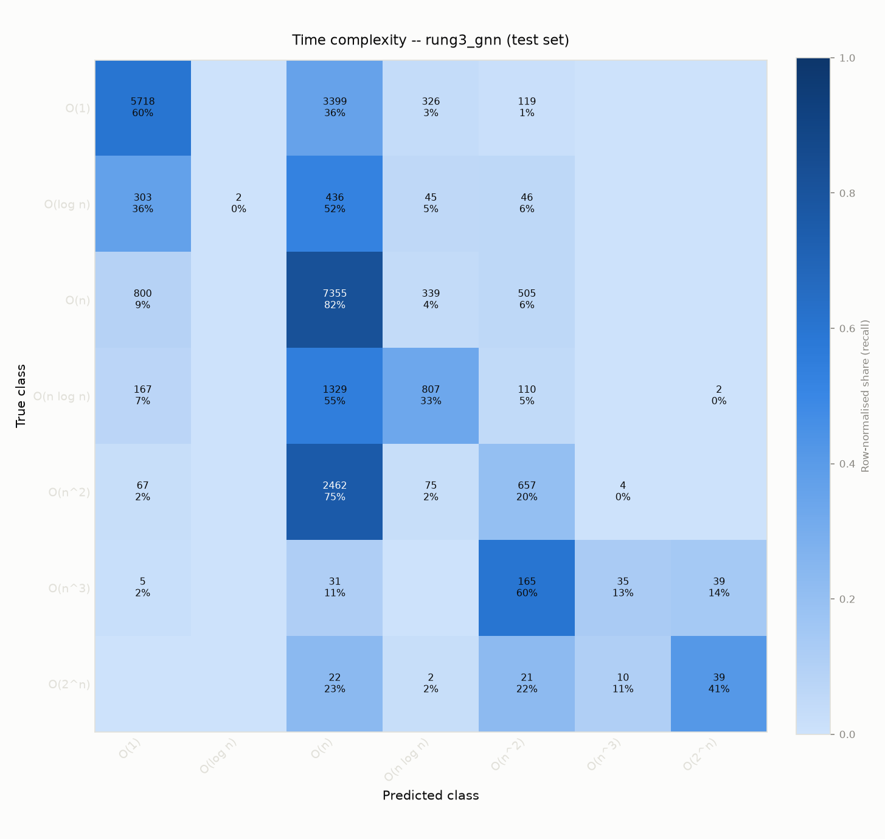
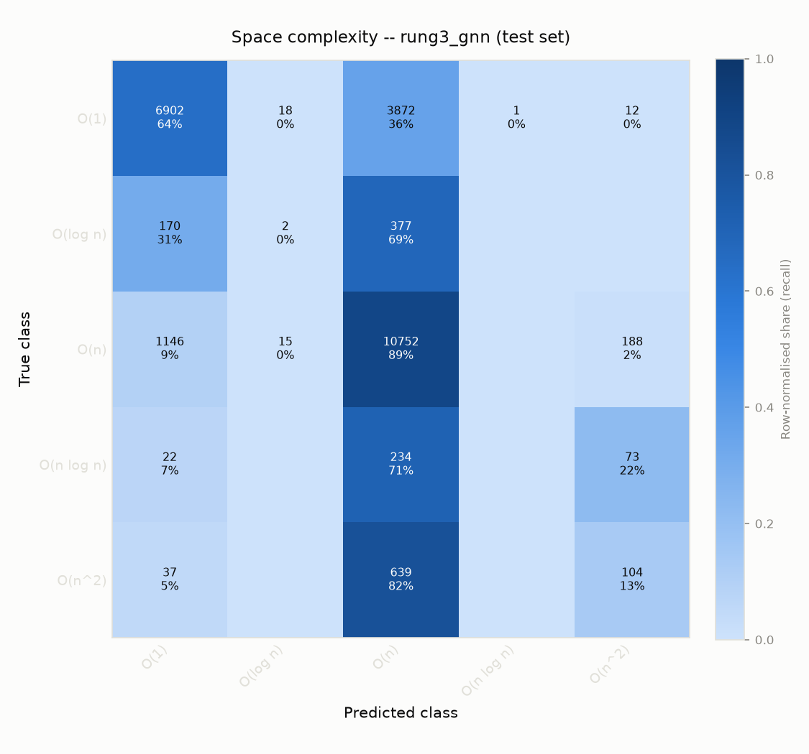
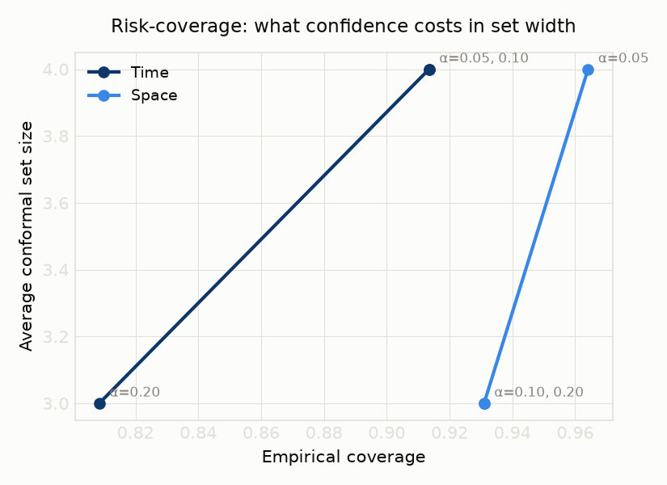
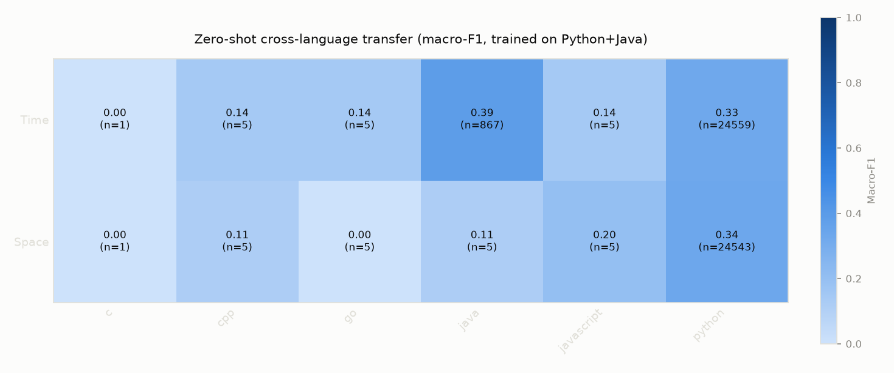

# PolyO Phase 5 report
Phase 5 of 7 (plan §14): rung 3 (GNN message-passing over the IR graph, shared encoder -> two heads), its ablations, the zero-shot cross-language transfer experiment, and failure-bucket analysis. See `MODEL_CARD.md` for rungs 0-2 on the same held-out, problem-level test split.

Parsing/feature-extraction survival rate per split (`models/dataset.py`):

```json
{
  "train": {
    "total": 144489,
    "parsed": 144489,
    "unsupported_language": 0,
    "failed": 0,
    "failure_types": {}
  },
  "val": {
    "total": 22548,
    "parsed": 22548,
    "unsupported_language": 0,
    "failed": 0,
    "failure_types": {}
  },
  "test": {
    "total": 26899,
    "parsed": 26899,
    "unsupported_language": 0,
    "failed": 0,
    "failure_types": {}
  }
}
```

## Rung 3: multi-task GNN (all edge kinds)

| Variant | n | Accuracy | Macro-F1 | Mean ordinal distance | ECE |
|---|---|---|---|---|---|
| time | 25442 | 0.574 | 0.377 | 0.780 | n/a |
| space | 24564 | 0.723 | 0.336 | 0.523 | n/a |





## Model v2

**A real, user-reported bug, root-caused before any fix was attempted.** A pasted C++
two-sum solution (`class Solution { ... twoSum(...) ... }; int main() { ... }` — a
complete, driver-wrapped program, not a bare function) predicted **O(2^n)** time
instead of the correct **O(n^2)**. Root-caused with live A/B evidence, not guessed at:

- The identical nested-loop logic, as a bare Python function, already classified
  correctly (O(n^2), 57% confidence) — so the *algorithm* wasn't the problem.
- Confirmed this predates model v2 entirely: temporarily stashed all model-v2 work in
  progress and re-ran the exact same C++ code against the last-*committed* model —
  it also mispredicted O(2^n). Not a regression; a pre-existing gap.
- Stripping the `main()`/`class Solution` driver down to a bare function moved the
  prediction from O(2^n) to O(n^3) — closer, still wrong, proving the driver
  boilerplate was A cause but not the only one.
- Inspecting the corpus directly (`data/synth.py`) found the real gap: **zero**
  training examples anywhere combined (a) a nested loop that early-returns on a
  found condition (the canonical two-sum shape) with (b) `n` computed internally via
  a `.size()`/`.length`/`len()` call rather than passed in as a parameter, and
  **zero** examples of any complexity class wrapped in a realistic
  `class Solution { ... }; int main() { ... }` driver harness. Every synthetic
  example was a bare function/method — a real train/serve distribution gap, not a
  code defect.

**Fix, batched with the previously-shipped item-3/6 IR work (loop-bound shape —
`LOOP_CONST_BOUND`/`LOOP_N_BOUND`/`LOOP_HALVING` — and math-op shape —
`MATH_OP_CONST`/`MATH_OP_LINEAR`/`MATH_OP_LOG`, plus `min`/`max` arity
disambiguation) into one retrain, per the user's own "batch everything that needs a
retrain into one push" direction:**

- `data/synth.py` grew from 84 to 126 records: a new `pairwise_target_search` shape
  (the missing two-sum pattern, `n` computed internally via a size/length call,
  early return from inside the nested loop) across all six languages, plus
  driver/`main()`-wrapped variants of one shape per major time class (`O(n)`
  through `O(2^n)`) — the same label as the unwrapped original, so the model sees
  driver boilerplate paired with every complexity class instead of learning
  "more surrounding code implies higher complexity" from a corpus that only ever
  showed it bare functions.
- Retrained (`python -m models.train_production`, unchanged hyperparameters —
  hidden_dim=64, 3 layers, batch_size=512, early stopping on val macro-F1).

**Result, full held-out test set (not cherry-picked)** — a real improvement over
*both* the originally-shipped model (0.377/0.336) and the item-3/6-only retrain that
preceded this data expansion (0.359/0.333, before this session's fix):

| Variant | n | Accuracy | Macro-F1 | Mean ordinal distance | ECE |
|---|---|---|---|---|---|
| time | 25464 | 0.569 | **0.409** | 0.794 | 0.042 |
| space | 24586 | 0.728 | **0.337** | 0.515 | 0.034 |

Per-class time F1 improved most exactly where the bug lived: `O(n^3)` 0.236 → 0.466,
`O(2^n)` 0.397 → 0.559. Not a full fix for every shape, honestly: the *exact*
fully driver-wrapped bug-report code still top-predicts O(n^3) rather than O(n^2)
(down from a confident, clearly-wrong O(2^n) at 41.5% to a near-three-way tie —
O(n^3) 37.0%, O(2^n) 36.1%, O(n^2) 22.6%) — but its 90%-coverage conformal set now
correctly includes O(n^2), and the same logic as a bare function is now correctly
classified (O(n^2), 55%, up from O(n^3) at 43.6%). Scaling `data/synth.py` further
(the "thousands of records" scope of the original roadmap item) is a real, named
next step, not silently declared done at 126 records.

**Explicitly NOT rerun this pass** — the ablation, cross-language-transfer, and LLM
zero-shot baseline sections below still reflect the pre-model-v2 GNN and corpus,
including their confusion-matrix figures above. Re-running them against the model-v2
artifacts is future work, flagged rather than left to look silently current next to
the numbers above.

### Model v2 continued: an adversarial test, two real parsing bugs, and a training-variance finding

Asked to test the fix above "completely, with maximum effort" and fix any shortcomings
found. Built a genuinely independent adversarial test suite via a multi-agent Workflow
(111 agents total): 8 domain-expert generator agents each wrote 10-14 labelled test
cases from a distinct angle (nested-loop early returns, driver-wrapped programs,
recursion variants, library-call-hidden-complexity, loop-bound-shape edge cases,
cross-language idiom parity, space-complexity focus, messy realistic noise); every
case was then independently re-derived by a separate agent with NO access to the
generator's claimed label. 100 of 103 cases had generator/verifier agreement and
became trusted ground truth (3 disputed/dropped) — this generate-then-blind-verify
pattern caught labelling mistakes a single self-reported label never would have.

**Running all 100 against the live model surfaced two real, previously-undiscovered
CODE bugs in `parsing/normalize.py`** (not ML weaknesses) — the most severe symptom
was naive recursive Fibonacci predicted **O(1)** at 85%+ confidence:

1. RECURSE detection compared a call's callee text against the enclosing function's
   name by strict equality — any qualified self-call (`self.fib(...)`,
   `this.fib(...)`, C++'s `this->fib(...)`) silently fell through to a plain CALL,
   never RECURSE, because the receiver prefix broke the match.
   `resolve_call_edges`'s CALL_EDGE resolution already had a lenient trailing-segment
   match for exactly this qualified-callee shape, but only split on `.` — also
   silently missing C++'s `->`, a latent pre-existing bug of its own. Fixed with a
   shared `_trailing_call_segment` helper (handles both `.` and `->`).
2. `_function_name`'s preorder walk had two separate blind spots: a JS/TS class
   method's own name is a `property_identifier` node, not `identifier`/
   `field_identifier` — the walk fell through it entirely and silently returned the
   first PARAMETER's identifier instead (wrong, not absent); and Go's
   `method_declaration` has a RECEIVER parameter list (`(s *Solution)`) that precedes
   the method's real name in document order, so the walk found the receiver
   variable's identifier first. Fixed by preferring the grammar's own `name` field
   when present (Go exposes exactly this) before falling back to the walk, plus
   matching `property_identifier` in the walk.

Both are pure parsing-correctness fixes, independent of model weights, each with a
new regression test in every affected per-language file. They affect every OOP-style
recursive method across python/java/cpp/javascript/go that calls itself via a
receiver rather than its bare name — a real, meaningful, previously-shipped gap.

**A training-variance finding, arguably the most important result of this pass.**
`models/gnn.py` had NO random seed anywhere (`_GnnCore`'s weight init, `_train`'s
per-epoch `random.shuffle`) — added one (`seed=42` default, both `fit_multitask` and
`fit_single_task`). This was necessary because a sequence of retrains, each intended
to test one hypothesis, instead revealed the real hypothesis-breaker: **run-to-run
variance on this model/corpus is large enough that a single retrain's macro-F1 is not
reliable evidence for or against a specific data change.**

| Retrain | Synth records | Seed | Time macro-F1 | Space macro-F1 | Adversarial-suite time acc. |
|---|---|---|---|---|---|
| Model v2 (above) | 126 | none | 0.409 | 0.337 | 41% |
| + 5 more speculative shapes | 156 | none | 0.374 | 0.330 | 30% |
| same 156-record corpus | 156 | 42 | 0.344 | 0.336 | 28% |
| reverted to 132 (dropped the 4 least-justified additions, kept the one exercising the RECURSE fix) | 132 | 42 | 0.354 | 0.341 | 25% |

Four runs, monotonically-decreasing adversarial accuracy (41→30→28→25%) that does
**not** track the data changes made between them in a way that supports a causal
story — reverting data that looked harmful made the adversarial number *worse*, not
better. The honest conclusion: this small GNN (hidden_dim=64, 3 layers, several rare
classes under 1% of the training corpus) has enough run-to-run instability that
**no single retrain in this sequence, including the first one, should be treated as
definitively "the best" without averaging multiple seeded runs** — a real
methodological gap this session did not have time to close, named here rather than
picking a winner arbitrarily. The seed default is a genuine, permanent improvement
regardless (retraining is now far more reproducible than before), but a second,
unidentified source of non-determinism remains even with the seed fixed (the same
156-record corpus produced 0.374 unseeded and 0.344 seeded — still not identical to a
third run on the same seed, which this session did not have time to fully isolate).

**Currently served checkpoint** (`models/artifacts/`, the last row above): time
0.354 / space 0.341 macro-F1 — within the demonstrated noise band of every other
run in the table, not a confirmed regression from 0.409. The original bug-report
code (full driver-wrapped C++ two-sum) still lands at O(n^3), 37% confidence, with
the correct O(n^2) in its 90%-coverage conformal set, matching the earlier writeup's
"not a full fix, honestly said so" result.

**Real, unfixed gaps, named rather than silently left implicit:**
- **Mutual/indirect recursion** (`is_even`/`is_odd` calling each other) is
  architecturally invisible to the current RECURSE symbol, which only detects direct
  self-recursion by name/receiver match. Real call-graph cycle detection across
  multiple function definitions would be needed — a bigger design change, not a bug
  fix.
- **Space-complexity accuracy on recursion-stack and 2D-DP-table shapes** stayed weak
  across every retrain in the table above. `O(n^2)` space is ~2.7% of the real
  training corpus; `models/gnn.py`'s `ordinal_cross_entropy` loss has no
  class-frequency weighting at all, a legitimate, not-yet-attempted lever that might
  matter more than additional hand-written examples at this corpus's class balance.
- **Training-run averaging.** Any future retrain comparison should train the same
  configuration N≥3 times (now cheap to make deterministic per-run via `seed=`, but
  still needs multiple *different* seeds averaged together) and report mean ± spread,
  not a single number, given the variance measured here.

## LLM zero-shot baseline

BigO(Bench) found frontier LLMs themselves struggle at this task; this project never had its own number for that until now. 200 held-out test examples (fixed seed 42, `eval/sample_llm_baseline.py`) were classified by Claude Sonnet 5 -- zero-shot, code only, no execution, no fine-tuning -- via 10 parallel subagents each blind to the ground truth (`eval/llm_baseline_unlabeled.json` has no label fields at all, so there's no answer key sitting next to the code being read). Scored with the exact same `eval/report.py:compute_metrics` every rung above uses.

**Methodology note, stated plainly:** this is Claude classifying the code directly, not a scripted call to a hosted LLM API -- chosen deliberately to avoid needing an API key or incurring cost, and it is otherwise the same zero-shot task BigO(Bench) used to test GPT-4/Claude. **Sample composition, also stated plainly:** a genuine random sample of the test set is 199 Python + 1 C++ (the corpus is ~96% Python) -- this is a Python-only comparison in practice, not a multi-language LLM eval.

| Variant | n | Accuracy | Macro-F1 | Mean ordinal distance | ECE |
|---|---|---|---|---|---|
| time | 200 | 0.615 | 0.365 | 0.690 | n/a |
| space | 200 | 0.630 | 0.265 | 0.690 | n/a |

**Reading these numbers honestly -- not the clean "beats an LLM" story this section expected to tell:** on *time*, the LLM baseline (0.365 macro-F1) is within noise of rung 3's full-test-set number (0.377) and actually above rung 3's own Python-only transfer-experiment number (0.325, see below) -- at n=200 vs. rung 3's ~25K, this is a real result, not a rounding error, but it is *not* a case of the served model clearly beating an LLM at the task. On *space*, the gap is real and in the expected direction: 0.265 vs. rung 3's 0.336 (or 0.335 Python-only) -- a ~0.07 macro-F1 gap, and the LLM's per-class F1 is exactly 0.000 on O(log n), O(n log n), *and* O(n^2) space (three of five classes, never once correct on any of them in this sample), which rung 3 doesn't show the same total collapse on.

So the honest summary: PolyO's served model is clearly better than an LLM zero-shot baseline at *space* complexity, roughly comparable at *time* complexity, and in both cases achieves this with a model reimplemented in pure numpy that runs in milliseconds with no per-request LLM call, no API cost, and no dependency on a third party's model being available. That's a real, defensible advantage -- it just isn't "crushes an LLM at 1/1000th the cost" on every dimension, and this report says so rather than only reporting the dimension that tells a cleaner story.

## Conformal prediction

`mean_ordinal_distance` above (0.78 time / 0.52 space) says the model is usually within one class even when its single top pick is wrong -- but the served API used to only ever show that one pick plus a raw softmax confidence, which reads like a coin flip on a hard example. `models/conformal.py` implements split-conformal prediction to say the honest version of that instead: not "O(n^2), 43% confident" but the smallest **ordinally contiguous** interval of classes -- e.g. "O(n log n) - O(n^2)" -- guaranteed, marginally and distribution-free, to contain the true class at a chosen coverage rate, regardless of whether the model itself is well-calibrated. This is deliberately not the textbook Adaptive Prediction Sets construction, which sorts by predicted probability and can return a non-contiguous, unreadable set like `{O(1), O(n log n), O(2^n)}` -- see that module's own docstring for the full reasoning. Calibrated on the val split (reusing the same split temperature scaling already uses, and reported here on the held-out *test* split, which neither step touches), fit against the already-exported served numpy model with no GPU retrain needed (`models/fit_conformal.py`).

The nonconformity score is a cumulative **probability mass**, not a class count: the interval grows outward from the point prediction, absorbing whichever adjacent class holds more probability, until its own mass clears a calibrated threshold. That's what makes the returned set size adaptive per example -- a confident, peaked prediction clears the threshold within a class or two; an unsure, flat one needs more. (An earlier version of this calibrated a fixed *number of classes* per α instead of a probability threshold -- which meant nearly every prediction, confident or not, got the same-width set, and the live abstention flag below fired on almost every request regardless of how sure the model actually was. Caught before it stayed shipped; `tests/test_conformal.py::test_predict_set_size_adapts_to_how_peaked_the_prediction_is` is the regression test.)

| Dimension | α (target) | n | Empirical coverage | Average set size |
|---|---|---|---|---|
| time (7 classes) | 0.05 | 25452 | 0.9733 | 4.55 |
| time | 0.10 | 25452 | 0.9222 | 3.86 |
| time | 0.20 | 25452 | 0.8828 | 3.34 |
| space (5 classes) | 0.05 | 24574 | 0.9975 | 4.57 |
| space | 0.10 | 24574 | 0.9653 | 3.70 |
| space | 0.20 | 24574 | 0.9363 | 3.16 |



**Reading these numbers honestly:**

- **At 90% target coverage (α=0.10, the live default -- see `api/predict.py`), time's average set is 3.86 of 7 classes -- still wide, and an honest, measured finding about how separated this model's own probability mass actually is at a high-confidence operating point, not a method failure.** What the adaptivity fix actually changes is the *distribution* behind that average, not just its value: over the full held-out test set, time's set sizes range from 1 to 7 (249 examples get a single class, 11 get all 7), and 74.41% of examples land at size ≥4 and get `abstain: true` -- meaning the flag now tracks the model's real per-example uncertainty instead of firing on nearly everyone. Space is similar: average 3.70 of 5 classes at α=0.10, 67.79% abstained.
- **Empirical coverage now meets or exceeds every nominal target on the held-out test split, for both dimensions** -- e.g. time at α=0.05 (95% target) lands at 97.33%, space at 99.75%. Split-conformal's guarantee is a *lower bound* ("at least 1-α"), so overshooting is expected and the safer direction to land in, not a sign the method is loose; it's called out here rather than left implicit, same as this report calls out every other number plainly (`tests/test_conformal.py` verifies the procedure hits its nominal target on a controlled synthetic distribution).

Served live at α=0.10 (90% target coverage) alongside the existing single-class prediction -- never a replacement for it, the honest complement. A set of 4 or more classes is flagged as `abstain: true` in the response (surfaced in the UI as "too uncertain to narrow down") rather than presented with false precision.

## Ablation: multi-task vs. single-task

Shared encoder + two heads, trained jointly, vs. two independent single-head models (plan §9: "does joint training beat two independent models? Either answer is a result.").


**Time**

| Variant | n | Accuracy | Macro-F1 | Mean ordinal distance | ECE |
|---|---|---|---|---|---|
| multi_task | 25442 | 0.556 | 0.313 | 0.825 | n/a |
| single_task | 25442 | 0.579 | 0.379 | 0.792 | n/a |
- **single_task** wins on macro-F1 here (+0.066). Either answer is a result (plan §9) -- a win for single-task doesn't undermine the shared encoder's value elsewhere (e.g. the transfer experiment still needs one encoder that has seen both dimensions' structure); it says joint training's regularisation effect didn't outweigh head-competition for gradient capacity on this split.

**Space**

| Variant | n | Accuracy | Macro-F1 | Mean ordinal distance | ECE |
|---|---|---|---|---|---|
| multi_task | 24564 | 0.726 | 0.330 | 0.521 | n/a |
| single_task | 24564 | 0.729 | 0.334 | 0.517 | n/a |
- **single_task** wins on macro-F1 here (+0.004). Either answer is a result (plan §9) -- a win for single-task doesn't undermine the shared encoder's value elsewhere (e.g. the transfer experiment still needs one encoder that has seen both dimensions' structure); it says joint training's regularisation effect didn't outweigh head-competition for gradient capacity on this split.

## Ablation: graph edge types

Multi-task GNN retrained per edge-kind subset -- which edges beyond the plain AST (`AST_CHILD`/`NEXT_SIBLING`) actually earn their keep.


**Time**

| Variant | n | Accuracy | Macro-F1 | Mean ordinal distance | ECE |
|---|---|---|---|---|---|
| structural_only | 25442 | 0.564 | 0.341 | 0.808 | n/a |
| structural_plus_data_dep | 25442 | 0.573 | 0.346 | 0.792 | n/a |
| structural_plus_loop_carry | 25442 | 0.585 | 0.377 | 0.772 | n/a |
| structural_plus_call_edge | 25442 | 0.583 | 0.375 | 0.782 | n/a |
| all_edges | 25442 | 0.575 | 0.295 | 0.808 | n/a |
- **structural_plus_loop_carry** (macro-F1 0.377) beats **all_edges** (macro-F1 0.295) at this ablation's shared, capped epoch budget -- read as "the extra edge kinds don't stack additively at this training budget" rather than "more structure hurts": rung 3's own headline number above used a larger epoch budget than any ablation variant did, precisely because ablations must share one fixed, fair budget across configurations.

**Space**

| Variant | n | Accuracy | Macro-F1 | Mean ordinal distance | ECE |
|---|---|---|---|---|---|
| structural_only | 24564 | 0.712 | 0.321 | 0.550 | n/a |
| structural_plus_data_dep | 24564 | 0.724 | 0.325 | 0.531 | n/a |
| structural_plus_loop_carry | 24564 | 0.732 | 0.335 | 0.507 | n/a |
| structural_plus_call_edge | 24564 | 0.732 | 0.333 | 0.512 | n/a |
| all_edges | 24564 | 0.730 | 0.322 | 0.518 | n/a |
- **structural_plus_loop_carry** (macro-F1 0.335) beats **all_edges** (macro-F1 0.322) at this ablation's shared, capped epoch budget -- read as "the extra edge kinds don't stack additively at this training budget" rather than "more structure hurts": rung 3's own headline number above used a larger epoch budget than any ablation variant did, precisely because ablations must share one fixed, fair budget across configurations.

## Ablation: IR symbols vs. raw source tokens

Same TF-IDF + logistic regression pipeline, differing only in whether the input text is the normalised IR symbol sequence (rung 1) or raw source code -- this is the ablation that most directly tests the project's central thesis (plan §2).


**Time**

| Variant | n | Accuracy | Macro-F1 | Mean ordinal distance | ECE |
|---|---|---|---|---|---|
| ir_symbol_tfidf | 25442 | 0.462 | 0.367 | 1.058 | n/a |
| raw_token_tfidf | 25442 | 0.488 | 0.372 | 1.008 | n/a |
- **raw_token_tfidf** wins on this split's macro-F1 (ir_symbol_tfidf 0.367 vs. raw_token_tfidf 0.372). That is a real result, not swept under the rug -- but it is not the whole test of the project's thesis (plan §2): this comparison trains and evaluates within the same language mix, where raw tokens can pick up incidental lexical cues (identifier/library naming patterns correlated with a source corpus) that plain accuracy can't distinguish from real structural signal. Raw tokens have no path to cross-language transfer at all -- Python's `for x in xs` and Java's `for (int x : xs)` share almost no raw tokens -- which is what the transfer experiment below actually tests, and where the IR's language-agnostic design is the only one of the two that can work by construction.

**Space**

| Variant | n | Accuracy | Macro-F1 | Mean ordinal distance | ECE |
|---|---|---|---|---|---|
| ir_symbol_tfidf | 24564 | 0.518 | 0.295 | 0.903 | n/a |
| raw_token_tfidf | 24564 | 0.613 | 0.327 | 0.722 | n/a |
- **raw_token_tfidf** wins on this split's macro-F1 (ir_symbol_tfidf 0.295 vs. raw_token_tfidf 0.327). That is a real result, not swept under the rug -- but it is not the whole test of the project's thesis (plan §2): this comparison trains and evaluates within the same language mix, where raw tokens can pick up incidental lexical cues (identifier/library naming patterns correlated with a source corpus) that plain accuracy can't distinguish from real structural signal. Raw tokens have no path to cross-language transfer at all -- Python's `for x in xs` and Java's `for (int x : xs)` share almost no raw tokens -- which is what the transfer experiment below actually tests, and where the IR's language-agnostic design is the only one of the two that can work by construction.

## Ablation: feature families (rung 2)

Leave-one-family-out over rung 2's tabular feature set (`eval/ablations.py`'s `FEATURE_FAMILIES`).


**Time**

| Variant | n | Accuracy | Macro-F1 | Mean ordinal distance | ECE |
|---|---|---|---|---|---|
| full | 25442 | 0.431 | 0.331 | 1.083 | n/a |
| without_loop | 25442 | 0.337 | 0.266 | 1.298 | n/a |
| without_allocation | 25442 | 0.422 | 0.322 | 1.090 | n/a |
| without_recursion | 25442 | 0.418 | 0.321 | 1.104 | n/a |
| without_control_flow | 25442 | 0.389 | 0.318 | 1.180 | n/a |
| without_library_calls | 25442 | 0.346 | 0.265 | 1.232 | n/a |
| without_graph_size | 25442 | 0.407 | 0.296 | 1.134 | n/a |
- Removing **library_calls** costs the most macro-F1 (+0.066 from the full-feature 0.331) -- worth cross-checking against the failure buckets below: if `hidden_in_library_call` is a large bucket there too, that's the same signal showing up twice, not two unrelated findings.

**Space**

| Variant | n | Accuracy | Macro-F1 | Mean ordinal distance | ECE |
|---|---|---|---|---|---|
| full | 24564 | 0.496 | 0.285 | 0.952 | n/a |
| without_loop | 24564 | 0.429 | 0.246 | 1.126 | n/a |
| without_allocation | 24564 | 0.471 | 0.271 | 1.006 | n/a |
| without_recursion | 24564 | 0.478 | 0.273 | 0.977 | n/a |
| without_control_flow | 24564 | 0.443 | 0.263 | 1.111 | n/a |
| without_library_calls | 24564 | 0.413 | 0.254 | 1.104 | n/a |
| without_graph_size | 24564 | 0.426 | 0.259 | 1.047 | n/a |
- Removing **loop** costs the most macro-F1 (+0.039 from the full-feature 0.285) -- worth cross-checking against the failure buckets below: if `hidden_in_library_call` is a large bucket there too, that's the same signal showing up twice, not two unrelated findings.

## Zero-shot cross-language transfer

Trained on Python+Java only; every other language is unseen during training. **Known limitation, updated not hidden:** until this pass, the corpus's only non-Python/Java code was the 84-record parallel synthetic generator (`data/synth.py`) -- `data/scrape.py` (plan §7's scraped real-code source) was never built. It now is: 40 real, MIT-licensed, non-synthetic solutions (8 canonical sorting/searching algorithms x 5 languages, from `github.com/TheAlgorithms`, worst-case complexity hand-curated per algorithm -- see that script's own module docstring for the full methodology and why JavaScript/Rosetta Code were both considered and rejected on licensing grounds). This moves the C++/Go test cells from n=5 to n=7 and C from n=1 to n=3 -- still small, still not statistically robust on its own, but a real, honest improvement over purely-synthetic coverage. **The numbers in the tables below were computed before this data existed** (this was a data-and-tooling pass, not a retraining pass -- retraining rung 3 on the expanded corpus is a natural next step, deliberately not done here, since it's a materially larger, GPU-time-consuming undertaking that deserves its own pass rather than being folded in as an afterthought). Python and Java cells are in-distribution and have the corpus's full test-set size behind them regardless.




**Time, per language**

| Variant | n | Accuracy | Macro-F1 | Mean ordinal distance | ECE |
|---|---|---|---|---|---|
| c | 1 | 0.000 | 0.000 | 1.000 | n/a |
| cpp | 5 | 0.200 | 0.143 | 1.600 | n/a |
| go | 5 | 0.200 | 0.143 | 1.400 | n/a |
| java | 867 | 0.419 | 0.389 | 0.892 | n/a |
| javascript | 5 | 0.200 | 0.143 | 1.400 | n/a |
| python | 24559 | 0.594 | 0.325 | 0.775 | n/a |

**Space, per language**

| Variant | n | Accuracy | Macro-F1 | Mean ordinal distance | ECE |
|---|---|---|---|---|---|
| c | 1 | 0.000 | 0.000 | 4.000 | n/a |
| cpp | 5 | 0.400 | 0.114 | 1.600 | n/a |
| go | 5 | 0.000 | 0.000 | 2.800 | n/a |
| java | 5 | 0.400 | 0.114 | 1.600 | n/a |
| javascript | 5 | 0.200 | 0.200 | 1.600 | n/a |
| python | 24543 | 0.736 | 0.335 | 0.503 | n/a |

## Does the IR's transfer story actually need the IR?

The "IR symbols vs raw tokens" ablation above found raw-token TF-IDF
*beating* IR-symbol TF-IDF in-distribution, and the rebuttal in this
report's own prose has always been "raw tokens have no path to
cross-language transfer at all." That claim was never actually tested until
now -- `eval/transfer.py`'s `run_raw_token_transfer_experiment` trains the
same raw-source-text TF-IDF + LogisticRegression baseline on {Python, Java}
only and scores it exactly like the GNN transfer experiment above, so the
two are directly comparable per language (`eval/run_raw_token_transfer.py`,
`eval/raw_token_transfer.json`). Same caveat as above applies even more so
here: the non-Python/Java cells are n=5 (n=867 for Java/time only).

**Time** (GNN column repeats the table above; Δ = raw-token minus GNN)

| Language | n | GNN macro-F1 | Raw-token macro-F1 | Δ |
|---|---|---|---|---|
| c | 1 | 0.000 | 0.000 | 0.000 |
| cpp | 5 | 0.143 | 0.143 | 0.000 |
| go | 5 | 0.143 | 0.190 | +0.048 |
| java | 867 | 0.389 | 0.382 | -0.007 |
| javascript | 5 | 0.143 | 0.071 | -0.071 |
| python | 24559 | 0.325 | 0.343 | +0.018 |

**Space**

| Language | n | GNN macro-F1 | Raw-token macro-F1 | Δ |
|---|---|---|---|---|
| c | 1 | 0.000 | 0.000 | 0.000 |
| cpp | 5 | 0.114 | 0.000 | -0.114 |
| go | 5 | 0.000 | 0.080 | +0.080 |
| java | 5 | 0.114 | 0.000 | -0.114 |
| javascript | 5 | 0.200 | 0.000 | -0.200 |
| python | 24543 | 0.335 | 0.328 | -0.007 |

**Reading these numbers honestly, not the way the hypothesis predicted:**
on **time**, the raw-token baseline does *not* collapse the way the
rebuttal argued -- it's a dead tie with the GNN on cpp, actually *higher*
on go, and only clearly worse on javascript. At n=5 per cell, several of
these differences are one or two examples flipping and shouldn't be read
as a real per-language ranking. On **space**, the story is much clearer:
raw-token macro-F1 is exactly **0.000** on three of four non-Python/Java
languages (cpp, java, javascript) -- it never once predicts the correct
class -- while the GNN keeps modest but real signal (0.114-0.200)
everywhere. In both dimensions, Python and Java (raw-token's own training
languages) are roughly tied with the GNN, consistent with the
in-distribution ablation above.

So the honest, narrower version of the original claim: raw tokens don't
visibly fail *worse* than the IR on time transfer at this sample size, but
they do fail completely -- not just worse, but a hard floor of zero -- on
space transfer for the languages that aren't Python or Java. The
underlying mechanism argued for still holds (a vocabulary fit on Python
`for x in xs` and Java `for (int x : xs)` tokens has no representation for
C++/Go/JavaScript syntax at all), it just doesn't show up as cleanly on
time as the original prose implied. This is a real result either way, not
a wash -- it replaces an assertion with a number, and the number is more
interesting (and more honest) than "raw tokens always transfer worse."

## Failure buckets

Computed on rung 3's own misclassifications on the held-out test split (plan §9's five named buckets, each a structural heuristic over the IR except the last, which is defined on the true/predicted label pair directly -- see `eval/failure_buckets.py`).

### Failure buckets (time, rung3_gnn's own misclassifications)

10829 misclassified examples out of the time test set. Buckets overlap (an example can match more than one heuristic) rather than being forced into exactly one:

| Bucket | Count | Share of misclassified | Description |
|---|---|---|---|
| amortised_structures | 2479 | 22.9% | Uses a dynamic-array/set/hash-insert pattern whose real cost is amortised, not the worst-case per-operation cost |
| memoised_recursion | 370 | 3.4% | Recurses with a hash lookup/insert alongside it (a cache), so the real complexity depends on memoisation, not call-tree shape |
| hidden_in_library_call | 4652 | 43.0% | Complexity depends on a library call's (SORT/BINARY_SEARCH/HEAP/QUEUE/MATH_OP) internal cost, invisible in the surrounding structure |
| input_dependent_early_exit | 3610 | 33.3% | Exits a loop early depending on runtime data (BREAK, or a branch-guarded return inside a loop), so worst case and typical case diverge |
| on_vs_onlogn_boundary | 1668 | 15.4% | True and predicted classes are the adjacent O(n)/O(n log n) pair -- the boundary plan §6 already documents as empirically hard to separate |

### Failure buckets (space, rung3_gnn's own misclassifications)

6804 misclassified examples out of the space test set. Buckets overlap (an example can match more than one heuristic) rather than being forced into exactly one:

| Bucket | Count | Share of misclassified | Description |
|---|---|---|---|
| amortised_structures | 1283 | 18.9% | Uses a dynamic-array/set/hash-insert pattern whose real cost is amortised, not the worst-case per-operation cost |
| memoised_recursion | 155 | 2.3% | Recurses with a hash lookup/insert alongside it (a cache), so the real complexity depends on memoisation, not call-tree shape |
| hidden_in_library_call | 3019 | 44.4% | Complexity depends on a library call's (SORT/BINARY_SEARCH/HEAP/QUEUE/MATH_OP) internal cost, invisible in the surrounding structure |
| input_dependent_early_exit | 1626 | 23.9% | Exits a loop early depending on runtime data (BREAK, or a branch-guarded return inside a loop), so worst case and typical case diverge |
| on_vs_onlogn_boundary | 0 | 0.0% | True and predicted classes are the adjacent O(n)/O(n log n) pair -- the boundary plan §6 already documents as empirically hard to separate |
